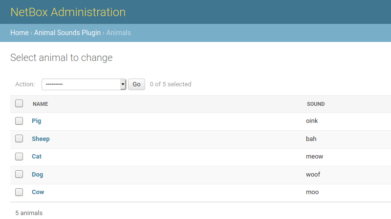
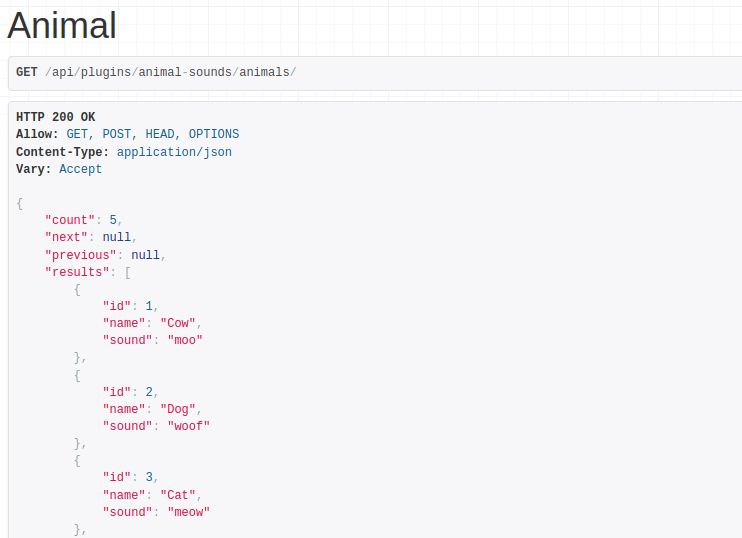

# Plugin Development

This documentation covers the development of custom plugins for NetBox. Plugins are essentially self-contained [Django apps](https://docs.djangoproject.com/en/stable/) which integrate with NetBox to provide custom functionality. Since the development of Django apps is already very well-documented, we'll only be covering the aspects that are specific to NetBox.

Plugins can do a lot, including:

* Create Django models to store data in the database
* Provide their own "pages" (views) in the web user interface
* Establish their own REST API endpoints
* Add custom request/response middleware

However, keep in mind that each piece of functionality is entirely optional. For example, if your plugin merely adds a piece of middleware or an API endpoint, there's no need to define a new model.

## Initial Setup

## Plugin Structure

Although the specific structure of a plugin is largely left to the discretion of its authors, a typical NetBox plugin looks something like this:

```no-highlight
plugin_name/
  - plugin_name/
    - templates/
      - *.html
    - __init__.py
    - middleware.py
    - navigation.py
    - signals.py
    - template_content.py
    - urls.py
    - views.py
  - README
  - setup.py
```

The top level is the project root, which is typically synonymous with the git repository. Within the root should exist several files:

* `setup.py` - This is a standard Python installation script used to install the plugin package within the Python environment.
* `README` - A brief introduction to your plugin, how to install and configure it, where to find help, and any other pertinent information. It is recommended to write README files using a markup language such as Markdown.
* The plugin source directory, with the same name as your plugin.

The plugin source directory contains all of the actual Python code and other resources used by your plugin. Its structure is left to the author's discretion, however it is recommended to follow best practices as outlined in the [Django documentation](https://docs.djangoproject.com/en/stable/intro/reusable-apps/). At a minimum, this directory **must** contain an `__init__.py` file containing an instance of NetBox's `PluginConfig` class.

### Create setup.py

`setup.py` is the [setup script](https://docs.python.org/3.6/distutils/setupscript.html) we'll use to install our plugin once it's finished. This script essentially just calls the setuptools library's `setup()` function to create a Python distribution package. We can pass a number of keyword arguments to information the package creation as well as to provide metadata about the plugin. An example `setup.py` is below:

```python
from setuptools import find_packages, setup

setup(
    name='netbox-animal-sounds',
    version='0.1',
    description='Show animals and the sounds they make',
    url='https://github.com/example-org/animal-sounds',
    author='Author Name',
    author_email='author@example.com',
    license='Apache 2.0',
    install_requires=[],
    packages=find_packages(),
    include_package_data=True,
    entry_points={
        'netbox_plugins': 'netbox_animal_sounds=netbox_animal_sounds:AnimalSoundsConfig'
    }
)
```

Many of these are self-explanatory, but for more information, see the [setuptools documentation](https://setuptools.readthedocs.io/en/latest/setuptools.html).

The key requirement for a NetBox plugin is the presence of an entry point for `netbox_plugins` pointing to the `PluginConfig` subclass, which we'll define next.

### Define a PluginConfig

The `PluginConfig` class is a NetBox-specific wrapper around Django's built-in [`AppConfig`](https://docs.djangoproject.com/en/stable/ref/applications/). It is used to declare NetBox plugin functionality within a Python package. Each plugin should provide its own subclass, defining its name, metadata, and default and required configuration parameters. An example is below:

```python
from extras.plugins import PluginConfig

class AnimalSoundsConfig(PluginConfig):
    name = 'netbox_animal_sounds'
    verbose_name = 'Animal Sounds Plugin'
    version = '0.1'
    author = 'Author Name'
    description = 'Show animals and the sounds they make'
    url_slug = 'animal-sounds'
    required_settings = []
    default_settings = {
        'loud': False
    }
```

#### PluginConfig Attributes

* `name` - Raw plugin name; same as the plugin's source directory
* `author_name` - Name of plugin's author
* `author_email` - Author's public email address
* `verbose_name` - Human-friendly name
* `version` - Plugin version
* `description` - Brief description of the plugin's purpose
* `url_slug` - Base path to use for plugin URLs (optional). If not specified, the project's `name` will be used.
* `required_settings`: A list of configuration parameters that **must** be defined by the user
* `default_settings`: A dictionary of configuration parameter names and their default values
* `min_version`: Minimum version of NetBox with which the plugin is compatible
* `max_version`: Maximum version of NetBox with which the plugin is compatible
* `middleware`: A list of middleware classes to append after NetBox's build-in middleware.
* `caching_config`: Plugin-specific cache configuration

### Install the Plugin for Development

To ease development, it is recommended to go ahead and install the plugin at this point using setuptools' "develop" mode. This will create symbolic links within your Python environment to the plugin development directory. Call `setup.py` from the plugin's root directory with the `develop` argument (instead of `install`):

```no-highlight
$ python setup.py develop
```

## Database Models

If your plugin introduces a new type of object in NetBox, you'll probably want to create a Django model for it. A model is essentially a Python representation of a database table, with attributes that represent individual columns. Model instances can be created, manipulated, and deleted using the [Django ORM](https://docs.djangoproject.com/en/stable/topics/db/). Models are typically defined within a plugin's `models.py` file, though this is not a strict requirement.

Below is a simple example `models.py` file showing a model with two character fields:

```python
from django.db import models

class Animal(models.Model):
    name = models.CharField(max_length=50)
    sound = models.CharField(max_length=50)

    def __str__(self):
        return self.name
```

Once you have defined the model(s) for your plugin, you'll need to create the necessary database schema migrations as well. This can be done using the Django `makemigrations` management command.

!!! note
    A plugin must be installed before it can be used with Django management commands. If you skipped this step above, run `python setup.py develop` from the plugin's root directory.

```no-highlight
$ ./manage.py makemigrations netbox_animal_sounds 
Migrations for 'netbox_animal_sounds':
  /home/jstretch/animal_sounds/netbox_animal_sounds/migrations/0001_initial.py
    - Create model Animal
```

Once you're satisfied the migration is ready and all model changes have been accounted for, we can apply it locally with the `migrate` command:

```no-highlight
$ ./manage.py migrate netbox_animal_sounds
Operations to perform:
  Apply all migrations: netbox_animal_sounds
Running migrations:
  Applying netbox_animal_sounds.0001_initial... OK
```

For more information on database migrations, see the [Django documentation](https://docs.djangoproject.com/en/stable/topics/migrations/).

### Using the Django Admin Interface

Plugins can optionally expose their models via Django's built-in [administrative interface](https://docs.djangoproject.com/en/stable/ref/contrib/admin/). This can greatly improve troubleshooting ability, particularly during development. An example `admin.py` file for the above model is shown below:

```python
from django.contrib import admin
from .models import Animal

@admin.register(Animal)
class AnimalAdmin(admin.ModelAdmin):
    list_display = ('name', 'sound')
``` 

This will display the plugin and its model in the admin UI. Staff users can create, change, and delete model instances via the admin UI without needing to create a custom view.



## Views

If your plugin needs its own page or pages in the NetBox web UI, you'll need to define views. A view is a particular page tied to a URL within NetBox. Views are typically defined in `views.py`, and URL patterns in `urls.py`. As an example, let's write a view which displays a random animal and the sound it makes. First, we'll create the view in `views.py`:

```python
from django.shortcuts import render
from django.views.generic import View
from .models import Animal

class RandomAnimalSoundView(View):

    def get(self, request):
        animal = Animal.objects.order_by('?').first()

        return render(request, 'animal_sound.html', {
            'animal': animal,
        })
```

This view retrieves a random animal from the database and and passes it as a context variable when rendering ta template named `animal_sound.html`. To create this template, create a `templates/` directory within the plugin source directory and save the following:

```jinja2



The {{ animal.name }} says {{ animal.sound }}

```

!!! note
    Django renders templates with its own custom [template language](https://docs.djangoproject.com/en/stable/topics/templates/#the-django-template-language). This is very similar to Jinja2, however there are some important differences to be aware of.

Finally, to make the view accessible to users, we need to register a URL for it. We do this in `urls.py`:

```python
from django.urls import path
from .views import RandomAnimalSoundView

urlpatterns = [
    path('random-sound/', RandomAnimalSoundView.as_view())
]
```

This makes our view accessible at the URL `/plugins/animal-sounds/random-sound/`. (Remember, our `AnimalSoundsConfig` class sets our plugin's base URL to `animal-sounds`.) Viewing this URL should show the base NetBox template with our custom content inside it.

## REST API Endpoints

Plugins can declare custom endpoints on NetBox's REST API to retrieve or manipulate models or other data. These behave very similarly to views, except that instead of rendering arbitrary content using a template, data is returned in JSON format using a serializer. NetBox uses the [Django REST Framework](https://www.django-rest-framework.org/), which makes writing API serializers and views very simple.

First, we'll create a serializer for our `Animal` model, in `api/serializers.py`:

```python
from rest_framework.serializers import ModelSerializer
from netbox_animal_sounds.models import Animal

class AnimalSerializer(ModelSerializer):

    class Meta:
        model = Animal
        fields = ('id', 'name', 'sound')
```

Next, we'll create a generic API viewset that allows basic CRUD (create, read, update, and delete) operations for Animal instances. This is defined in `api/views.py`:

```python
from rest_framework.viewsets import ModelViewSet
from netbox_animal_sounds.models import Animal
from .serializers import AnimalSerializer

class AnimalViewSet(ModelViewSet):
    queryset = Animal.objects.all()
    serializer_class = AnimalSerializer
```

Finally, we'll register a URL for our endpoint in `api/urls.py`. This file **must** define a variable named `urlpatterns`.

```python
from rest_framework import routers
from .views import AnimalViewSet

router = routers.DefaultRouter()
router.register('animals', AnimalViewSet)
urlpatterns = router.urls
```

With these three components in place, we can request `/api/plugins/animal-sounds/animals/` to retrieve a list of all Animal objects defined.



!!! note
    This example is provided as a minimal reference implementation only. It does not address authentication, performance, or myriad other concerns that plugin authors should have.
